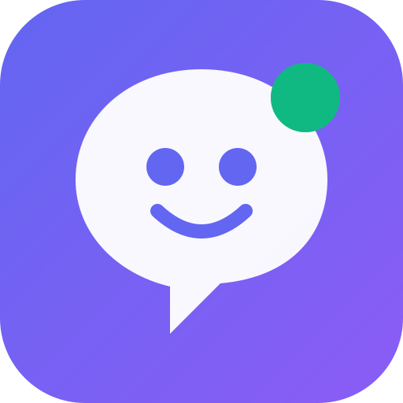

<p align="center">
  
</p>

<h1 align="center">VibeBuddy</h1>

<p align="center">
  <strong>Turn any device into an AI coding companion display</strong>
</p>

<p align="center">
  
  
  
  
</p>

---

VibeBuddy repurposes an old phone (or any browser) as a real-time status display for AI coding tools on your PC. Think of it as an **andon board** for your coding sessions — see what the AI is thinking, what tools it's running, and approve permissions directly from your phone.

**How it works:**

```
┌─────────────┐       WiFi        ┌──────────────────┐       HTTP       ┌──────────────┐
│   Phone /   │ ◄── WebSocket ──► │  Relay Hub :4097 │ ◄──────────────► │  OpenCode /  │
│   Browser   │                   │     (PC)         │                  │  AI Tool     │
└─────────────┘                   └──────────────────┘                  └──────────────┘
```

## Features

- **Andon display** — real-time status: THINKING / EXECUTING / IDLE / ERROR
- **Tool tracking** — see which tools the AI calls, with live counters
- **Remote approval** — approve or deny tool permissions from your phone
- **Duration timer** — track how long each session takes
- **Activity log** — scrollable event history
- **Zero build step** — plain HTML/CSS/JS, works on Android 6+
- **Multi-tool protocol** — works with OpenCode today, extensible to Claude Code, ZCode, etc.

## Quick Start

### 1. Start the relay on your PC

```cmd
cd server
npm install
npm run dev
```

The relay starts at `http://localhost:4097`.

Or double-click `Start VibeBuddy.bat` (Windows).

### 2. Open on your phone

Find your PC's LAN IP:

```cmd
ipconfig | findstr "IPv4"
```

Open `http://<PC-IP>:4097` in your phone browser. The page auto-connects.

### 3. Connect your AI tool

For **OpenCode**, install the plugin:

```cmd
cd E:\AI\.opencode
npm install vibe-companion-opencode-plugin
```

Configure `opencode.json`:

```json
{
  "plugin": ["./node_modules/vibe-companion-opencode-plugin/index.js"]
}
```

When OpenCode starts a session, VibeBuddy shows live status on your phone.

## OpenCode Plugin Features

| Feature | How it works |
|---------|-------------|
| Status events | Maps OpenCode events to THINKING/EXECUTING/IDLE |
| Tool tracking | Counts tool starts, failures, and completions |
| Permission approval | Intercepts `permission.ask` → phone → Allow/Deny |
| Forced tool approval | Set `VIBE_FORCE_TOOL_APPROVAL=1` to require phone approval for every tool call |
| Question answering | Shows multiple-choice questions on phone |

## Architecture

```
app/                    # PWA — phone companion display
  index.html            # single-page app
  css/main.css          # styles + andon theme
  js/legacy-app.js      # main app logic
  logo.svg              # VibeBuddy logo
  manifest.json         # PWA manifest

server/                 # PC relay hub
  src/index.ts          # HTTP + WebSocket server
  src/types.ts          # shared types
  package.json          # scripts and deps

opencode-plugin/        # OpenCode adapter plugin
  index.js              # event hooks + permission bridge

docs/                   # documentation
```

## Verification

VibeBuddy has 6 levels of automated testing:

| Level | What it tests | Command |
|-------|--------------|---------|
| VM unit | Stats counting logic | `npm run verify:pwa-stats` |
| Firefox synthetic | Real browser DOM rendering | `npm run verify:firefox-stats` |
| Relay injection | Event broadcast transport | `npm run verify:stats` |
| Real OpenCode | Live AI session + tool stats | `npm run e2e:firefox-opencode` |
| Tool approval | Forced permission approval | `npm run e2e:firefox-opencode-approval` |
| Prompt matrix | 5-scenario reply isolation | `npm run e2e:firefox-relay-prompt` |

All run headless on Windows + Firefox. See [docs/local-e2e-verification.md](docs/local-e2e-verification.md).

## Configuration

| Environment Variable | Default | Description |
|---------------------|---------|-------------|
| `VIBE_PORT` | `4097` | Relay HTTP/WS port |
| `VIBE_AUTH_TOKEN` | (none) | Optional auth token |
| `VIBE_STATUS_SETTLE_MS` | `20000` | Auto-settle inactive sessions |
| `VIBE_REQUEST_TTL_MS` | `120000` | Permission/question timeout |
| `VIBE_FORCE_TOOL_APPROVAL` | (none) | Set `1` to force phone approval for every tool |

## Documentation

- [Requirements](docs/requirements.md) — product and system requirements
- [Architecture](docs/architecture.md) — design decisions and data flow
- [Protocol](docs/protocol.md) — Relay Hub HTTP/WebSocket protocol spec
- [Operations](docs/operations.md) — runbook and troubleshooting
- [Verification Matrix](docs/local-e2e-verification.md) — test levels and results
- [Android Test Plan](docs/android-browser-test-plan.md) — device acceptance steps

## Roadmap

- [x] Single-session andon display
- [x] Remote permission approval
- [x] OpenCode plugin with event + permission hooks
- [x] 6-level automated testing
- [ ] Multi-session support (switch between concurrent AI sessions)
- [ ] Desktop/browser terminal (not just phone)
- [ ] Voice input relay (phone mic → PC)
- [ ] Camera/OCR capture

## License

MIT
